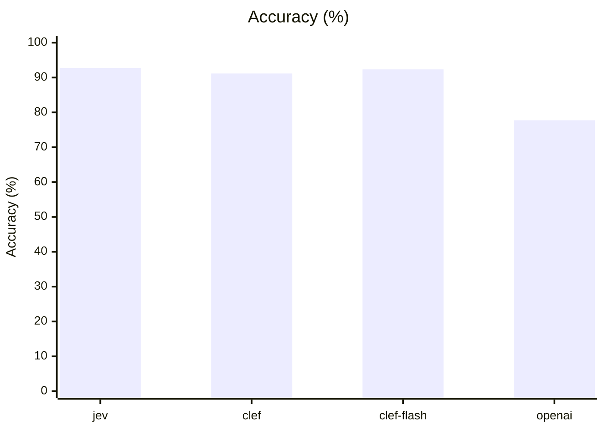
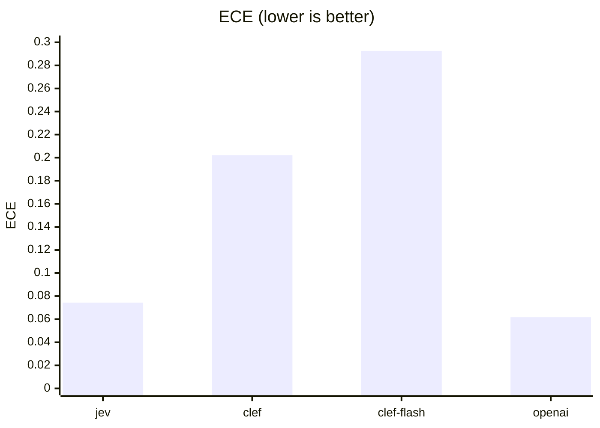
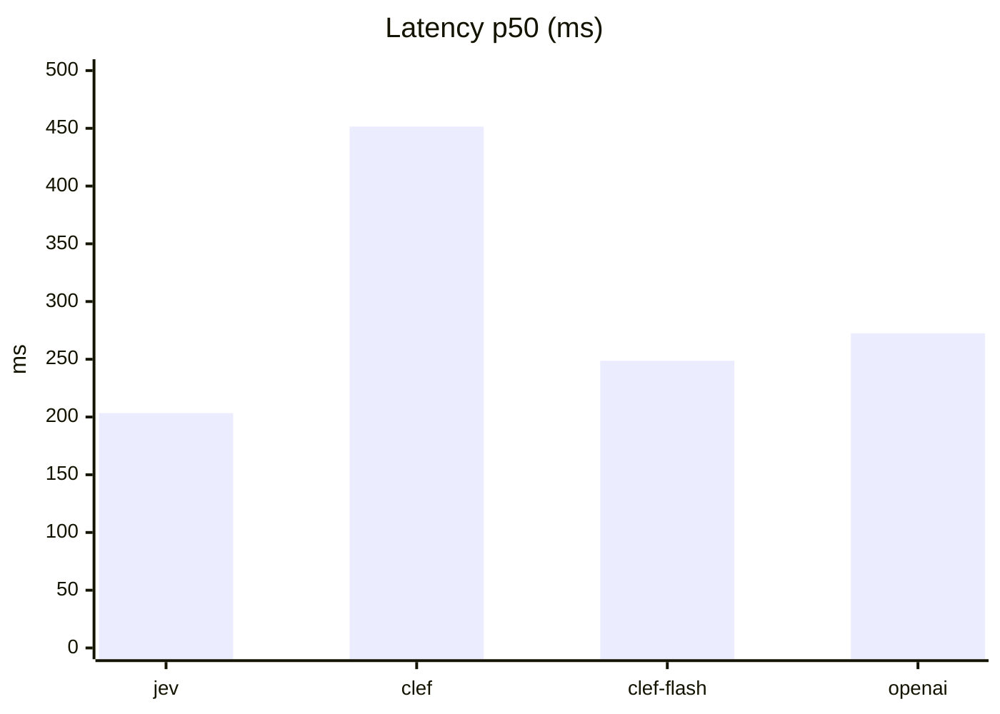
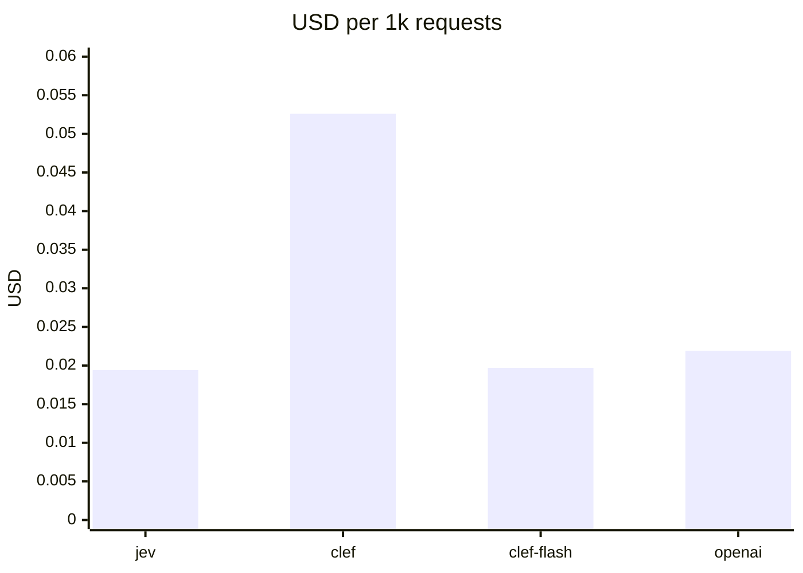

# Japanese Decision Model Benchmark

日本語の decision model を、固定された同一データセットで比較するベンチマークです。精度だけでなく、確率の校正、レイテンシ、トークン使用量、口語・typo・日本語と英語の混在などへの頑健性を測定します。

OpenAI Decisions API の公開前にデータセットを固定し、公開後に評価条件を後付けで変更しないことを目的としています。OpenAI Decisions API は 2026-10-06 に public beta として公開されたため、同じ dataset v1 と同じ実行条件で計測しました。

## 現在の状態

- TypeSafe Jev adapter: 実行可能 (`bun run bench:jev`)
- Cloudflare Clef adapter: 実行可能 (`bun run bench:clef`)
- Cloudflare Clef-flash adapter: 実行可能 (`bun run bench:clef-flash`)
- OpenAI Decisions API adapter: 実行可能 (`bun run bench:openai`、`gpt-6-luna`、public beta)
- 日本語 dataset v1: **260件**

## 評価項目

- Accuracy
- Macro F1
- Multiclass Brier score
- ECE (Expected Calibration Error)
- latency p50 / p95 / p99
- latency の内訳（TTFB / body 受信 / 合計）
- input / output token usage
- 費用（合計 USD / 1000リクエストあたり USD）

probability / confidence を提供しない API の場合、その指標は `-` として扱います。

`latencyMs` はリクエスト開始からレスポンスヘッダ受信まで（TTFB）です。以前の結果と比較できるよう、この定義は変えていません。body の受信時間は `bodyMs` に別で記録します。

## 結果（2026-10-07 時点）

dataset v1（260件）、concurrency 4 で実行した結果です。jev / clef / clef-flash は 2026-10-04、openai-decisions は 2026-10-07（JST）に実行しました。単価は `pricing.json` の値（確認日は表に記載）を使っています。

### Quality

| Adapter | Completed | Accuracy | Macro F1 | Brier ↓ | ECE ↓ | p50 ms | p95 ms | p99 ms | Input tokens | Output tokens |
|---|---:|---:|---:|---:|---:|---:|---:|---:|---:|---:|
| jev | 260/260 | 92.69% | 92.30% | 0.1207 | 0.0744 | 203.4 | 284.9 | 340.5 | 120066 | 11823 |
| clef | 260/260 | 91.15% | 90.33% | 0.1410 | 0.2022 | 451.5 | 996.9 | 1481.6 | 56934 | 0 |
| clef-flash | 260/260 | 92.31% | 92.24% | 0.1444 | 0.2926 | 248.7 | 541.3 | 732.7 | 56934 | 0 |
| openai-decisions | 260/260 | 77.69% | 77.12% | 0.3052 | 0.0617 | 272.5 | 369.7 | 1130.5 | 56959 | 0 |

### Latency breakdown

TTFB はリクエスト開始からレスポンスヘッダ受信まで、Body はヘッダ受信から body の読み込み完了までです（単位 ms）。

| Adapter | TTFB p50 | TTFB p95 | Body p50 | Body p95 | Total p50 | Total p95 | Total p99 |
|---|---:|---:|---:|---:|---:|---:|---:|
| jev | 203.4 | 284.9 | 0.0 | 0.0 | 203.4 | 284.9 | 340.5 |
| clef | 451.5 | 996.9 | 0.0 | 1.7 | 451.5 | 996.9 | 1483.3 |
| clef-flash | 248.7 | 541.3 | 0.0 | 1.5 | 248.8 | 541.3 | 732.7 |
| openai-decisions | 272.5 | 369.7 | 0.0 | 0.0 | 272.5 | 369.7 | 1130.5 |

### Cost

| Adapter | Input $/1M tok | Output $/1M tok | Total USD | USD per 1k requests | Price checked |
|---|---:|---:|---:|---:|---|
| jev | $0.0420 | $0.0000 | $0.0050 | $0.0194 | 2026-10-04 |
| clef | $0.2400 | $0.0000 | $0.0137 | $0.0526 | 2026-10-04 |
| clef-flash | $0.0900 | $0.0000 | $0.0051 | $0.0197 | 2026-10-04 |
| openai-decisions | $0.1000 | $0.0000 | $0.0057 | $0.0219 | 2026-10-07 |

### グラフ









### タスク別 Accuracy（openai-decisions）

| Task | 正解 / 件数 | Accuracy |
|---|---:|---:|
| support-routing | 57 / 60 | 95.0% |
| risk-review | 57 / 60 | 95.0% |
| agent-action | 59 / 80 | 73.8% |
| model-routing | 29 / 60 | 48.3% |

多かった誤答は次のとおりです。

| Task | 正解 → 回答 | 件数 |
|---|---|---:|
| model-routing | balanced → fast | 19 |
| agent-action | execute_tool → human_review | 18 |
| model-routing | reasoning → balanced | 11 |

### 読み方

- jev / clef 系の Accuracy は 91〜93% でほぼ同じですが、ECE は jev が 0.074、clef 系は 0.20〜0.29 で、確率の校正には差があります。
- openai-decisions は Accuracy 77.69% で、他より 15 ポイント近く低いです。support-routing と risk-review は 95% で他と同程度なので、差は model-routing と agent-action に集中しています。model-routing では必要な reasoning 量を一段低く見積もり、agent-action ではツール実行で済むケースを human_review に回す傾向がありました。
- 一方で ECE は 0.062 と4つの中で一番低く、確信度は外れたときにはちゃんと低く出ています。Brier が悪いのは Accuracy の低さによるものです。
- openai-decisions の p99 は 1130ms ですが、p95 は 370ms です。1秒を超えたのは 260件中 7件だけでした。
- body の受信時間はどれもほぼ 0ms で、レイテンシのほとんどは TTFB（サーバー処理と往復）です。
- input tokens は tokenizer の違いで jev が clef 系の約2倍あるため、費用は token 単価ではなく 1000リクエストあたりで比べています。jev と clef-flash がほぼ同じで、clef は約2.7倍です。

## 費用の単価

費用は `pricing.json` の単価と token usage から `bun run report` の時点で計算します。単価を直したときは、ベンチを再実行せず `bun run report` だけで計算し直せます。

```json
{
  "jev": {
    "inputUsdPerMTok": 0.5,
    "outputUsdPerMTok": 2,
    "source": "https://...",
    "checkedAt": "2026-10-04"
  }
}
```

- 単価は USD / 1M tokens で、各社の公式料金ページから転記します（上の値は例です）
- `source` に根拠の URL、`checkedAt` に確認日、必要なら `note` に補足を書きます
- 単価が `null` の adapter は、費用を `-` と表示します
- エラーになったリクエストは token usage が取れないため、費用には含めません

## Dataset

`datasets/japanese-decision-v1/` 配下に JSONL shard として固定しています。

| Task | Cases |
|---|---:|
| support-routing | 60 |
| agent-action | 80 |
| risk-review | 60 |
| model-routing | 60 |
| **Total** | **260** |

含めている例:

- 日本語の通常表現
- 口語
- 曖昧な問い合わせ
- typo
- 日本語・英語混在
- 高影響操作
- 社内情報検索が必要なケース
- agent/tool routing
- reasoning量によるmodel routing

## セットアップ

Bun を使用します。

```bash
bun install
cp .env.example .env
```

Jev の API key を設定します。

```bash
export JEV_API_KEY=...
```

dataset の整合性確認と静的チェック:

```bash
bun run check
bun run typecheck
```

Jev を10件だけ実行:

```bash
bun run src/runner.ts \
  --adapter jev \
  --dataset datasets/japanese-decision-v1 \
  --limit 10 \
  --concurrency 2
```

全件:

```bash
bun run bench:jev
bun run bench:clef
bun run bench:clef-flash
bun run report
```

### Cloudflare Workers AI

Clef と Clef-flash は、Workers AI の公式 REST API を利用します。Workers AI 実行権限を持つ API token と Account ID を設定してください。

```bash
export CLOUDFLARE_ACCOUNT_ID=...
export CLOUDFLARE_API_TOKEN=...

bun run bench:clef
bun run bench:clef-flash
```

各アダプタは次の公式 endpoint に `model`、`state`、`questions` を直接渡します。

```text
POST https://api.cloudflare.com/client/v4/accounts/{account_id}/ai/run/@cf/cloudflare/{clef|clef-flash}
```

Cloudflare API が返す `result` envelope は共通の System One 互換層で展開するため、Jev と同じ結果形式で Accuracy、校正、レイテンシ、token usage を比較できます。

### OpenAI Decisions API

公式ガイドの schema どおり、`POST https://api.openai.com/v1/decisions` に `model`、`input`、`questions`（`type: "choice"` の質問1つ）を渡します。dataset の `choices` は `[{ value, description }]` に変換し、response の `probabilities` 配列は他の adapter と同じ `{ value: probability }` の形に変換して集計します。

```bash
export OPENAI_API_KEY=...
# 省略時は gpt-6-luna / https://api.openai.com/v1/decisions
# export OPENAI_DECISIONS_MODEL=gpt-6-luna
# export OPENAI_DECISIONS_ENDPOINT=https://api.openai.com/v1/decisions

bun run bench:openai
bun run report
```

public beta のため、GA 時に schema やモデルが変わったら再計測します。

## レポート

各実行は `results/{adapter}.jsonl` と `results/{adapter}.summary.json` を作成します。実行済みのアダプタを横並びで比較するには、次を実行します。

```bash
bun run report
```

`results/report.md` は Accuracy、Macro F1、Brier、ECE、p50/p95/p99 latency、input/output token usage を比較します。未実行のアダプタは表に含めません。

## 再現性

検証時には以下を保存してください。

- repository commit hash
- dataset SHA-256
- API / model version
- 実行日時
- concurrency
- 実行リージョン

各 shard の SHA-256 は `datasets/japanese-decision-v1.sha256` に記録しています。

公開前に生成した単一 JSONL の canonical SHA-256 は次です。

```text
2c083571017468960a2807291be4b71989801f2f1bc5708f6a6e1e79aa3a5271
```

## 構成

```text
.
├── datasets/
│   ├── japanese-decision-v1/
│   │   ├── agent-action-*.jsonl
│   │   ├── model-routing.jsonl
│   │   ├── risk-review-*.jsonl
│   │   └── support-routing-*.jsonl
│   └── japanese-decision-v1.sha256
├── results/
├── src/
│   ├── adapters/
│   │   ├── system-one.ts
│   │   ├── jev.ts
│   │   ├── cloudflare-clef.ts
│   │   ├── cloudflare-clef-flash.ts
│   │   └── openai-decisions.ts
│   ├── check-dataset.ts
│   ├── load-dataset.ts
│   ├── metrics.ts
│   ├── report.ts
│   ├── runner.ts
│   └── types.ts
└── package.json
```

## 参照元

- [Cloudflare Clef model documentation](https://developers.cloudflare.com/workers-ai/models/clef/)
- [Cloudflare Workers AI REST API](https://developers.cloudflare.com/workers-ai/get-started/rest-api/)
- [OpenAI Decisions API guide](https://developers.openai.com/api/docs/guides/decisions)
- TypeSafe Jev OpenAPI — `POST /v1/systemone`, choice, confidence, probabilities, token usage

## License

Dataset / benchmark code のライセンスは今後明示します。
